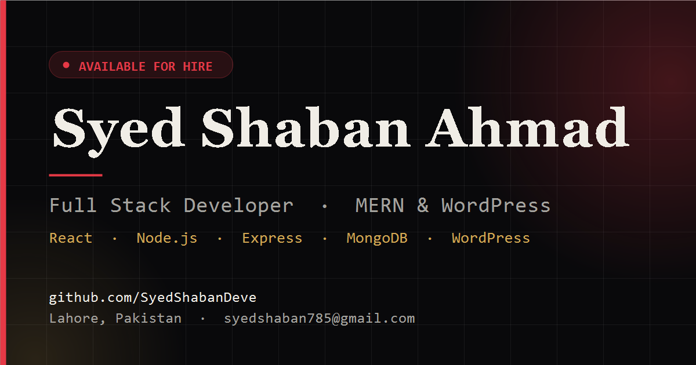

<div align="center">

# Syed Shaban Ahmad — Developer Portfolio

**Full Stack Developer · MERN &amp; WordPress · Lahore, Pakistan**

[](https://syedshabandeve.github.io/portfolio/)
[](https://react.dev)
[](https://vite.dev)
[](LICENSE)

<a href="https://syedshabandeve.github.io/portfolio/">
  
</a>

</div>

---

## About

A single-page portfolio built from scratch in React — no template, no page builder, no UI kit. It presents my experience, technical skills, and the client projects I have shipped, and gives recruiters a direct route to contact me.

**→ [View it live](https://syedshabandeve.github.io/portfolio/)**

## Features

- **Section-aware navigation** — an `IntersectionObserver` highlights the nav pill for whichever section is on screen.
- **Responsive by design** — a collapsible drawer replaces the pill bar under 860px, closing on `Escape`, on navigation, and on resize back to desktop.
- **Scroll-reveal animations** — a reusable `Reveal` component fades content in once, then disconnects its observer so nothing keeps running off-screen.
- **Animated typewriter headline** cycling through role titles.
- **Validated contact form** — client-side validation with inline, screen-reader-linked error messages; a valid submission opens the visitor's mail client with the whole message pre-composed.
- **Accessible** — semantic landmarks, `aria-invalid` / `aria-describedby` wiring on fields, labelled icon links, visible focus rings, and a `prefers-reduced-motion` fallback that disables animation.
- **SEO and social ready** — descriptive metadata, canonical URL, Open Graph and Twitter cards, plus JSON-LD `Person` structured data.

## Tech Stack

| Layer | Choice |
| --- | --- |
| Framework | React 19 |
| Build tool | Vite 8 |
| Styling | Plain CSS with custom properties (design tokens) + Tailwind utilities |
| Linting | ESLint 10 (react-hooks, react-refresh) |
| Hosting | GitHub Pages via `gh-pages` |

## Running Locally

```bash
git clone https://github.com/SyedShabanDeve/portfolio.git
cd portfolio
npm install
npm run dev
```

The dev server prints a local URL (Vite defaults to `http://localhost:5173`).

### Scripts

| Command | What it does |
| --- | --- |
| `npm run dev` | Start the dev server with hot module replacement |
| `npm run build` | Produce the optimised production bundle in `dist/` |
| `npm run preview` | Serve the built bundle locally |
| `npm run lint` | Run ESLint across the project |
| `npm run deploy` | Build, then publish `dist/` to GitHub Pages |

## Project Structure

```
portfolio/
├── public/
│   ├── og-image.png          # 1200x630 social preview card
│   ├── logo.svg              # Favicon and navbar mark
│   └── favicon.svg
├── src/
│   ├── components/
│   │   └── Portfolio.jsx     # Page sections, data, and the contact form
│   ├── index.css             # Design tokens, component classes, responsive rules
│   ├── App.jsx
│   └── main.jsx
├── index.html                # Metadata, Open Graph tags, JSON-LD
└── vite.config.js            # `base` is set to /portfolio/ for GitHub Pages
```

## Deployment

The site deploys to GitHub Pages from the `dist/` build:

```bash
npm run deploy
```

`vite.config.js` sets `base: '/portfolio/'` so hashed assets resolve correctly under the repository subpath. If you fork this and host it elsewhere, change `base` to match — and update the absolute URLs in `index.html` (canonical, `og:url`, `og:image`) to your own domain.

## Contact

- **Email** — [syedshaban785@gmail.com](mailto:syedshaban785@gmail.com)
- **LinkedIn** — [syedshaban785](https://www.linkedin.com/in/syedshaban785)
- **GitHub** — [SyedShabanDeve](https://github.com/SyedShabanDeve)
- **Location** — Lahore, Pakistan · open to remote work

## License

Released under the [MIT License](LICENSE). The code is free to reuse; please replace the personal content, images, and contact details with your own.
